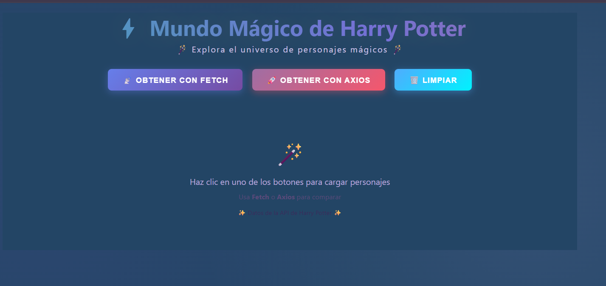

# API_hp

Proyecto web sencillo para consumir y mostrar informacion relacionada con Harry Potter.

## Archivos principales

- `index.html`: estructura de la pagina.
- `styles.css`: estilos de la interfaz.
- `app.js`: logica principal del proyecto.
- `funcion.js`: funciones auxiliares.

## Como usar

1. Abre `index.html` en tu navegador.
2. Si usas VS Code, puedes iniciar con Live Server para recarga automatica.

## Imágenes Representativas

### Vista Principal 



## Uso de la API

Este proyecto obtiene datos desde una API externa y los muestra en pantalla.
El flujo general es:

1. Hacer una solicitud HTTP a un endpoint.
2. Convertir la respuesta a JSON.
3. Recorrer los datos recibidos.
4. Renderizar el contenido en el DOM.

### Opcion 1: Usar fetch (nativo del navegador)

`fetch` ya viene incluido en JavaScript del navegador, por lo que no necesitas instalar nada.

```js
const url = 'https://hp-api.onrender.com/api/characters';

fetch(url)
	.then((response) => {
		if (!response.ok) {
			throw new Error('Error en la respuesta de la API');
		}
		return response.json();
	})
	.then((data) => {
		console.log('Personajes:', data);
		// Aqui puedes llamar a tu funcion para pintar datos en pantalla
	})
	.catch((error) => {
		console.error('Error al consultar la API con fetch:', error);
	});
```

### Opcion 2: Usar axios

`axios` simplifica el manejo de respuestas y errores.

Para usarlo en un proyecto con HTML simple, puedes agregar el CDN en `index.html`:

```html
<script src="https://cdn.jsdelivr.net/npm/axios/dist/axios.min.js"></script>
```

Ejemplo de consulta:

```js
const url = 'https://hp-api.onrender.com/api/characters';

axios
	.get(url)
	.then((response) => {
		const data = response.data;
		console.log('Personajes:', data);
		// Aqui puedes llamar a tu funcion para pintar datos en pantalla
	})
	.catch((error) => {
		console.error('Error al consultar la API con axios:', error);
	});
```

### Recomendacion practica

- Si estas aprendiendo JavaScript puro, empieza con `fetch`.
- Si quieres una sintaxis mas comoda y manejo de errores mas consistente, usa `axios`.


## Notas

- Asegurate de tener conexion a internet si la API se consulta en tiempo real.
- Puedes ajustar los estilos en `styles.css` y la logica en `app.js`.

## Actualizaciones del proyecto 

- Agregar mas botones para la clasificacion de los personajes
- Agregar una barra de busqueda 
- Agregar imagenes de los personajes

