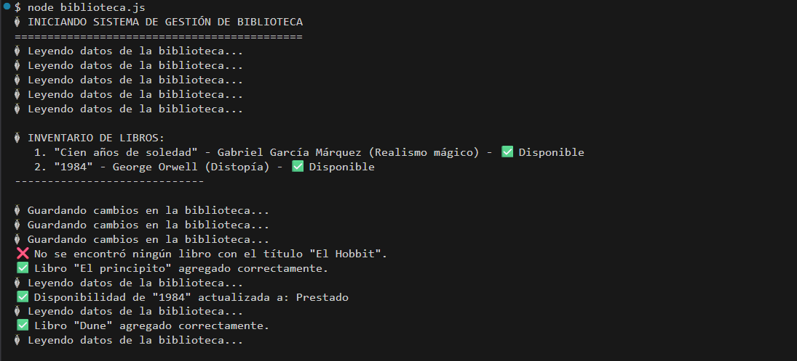
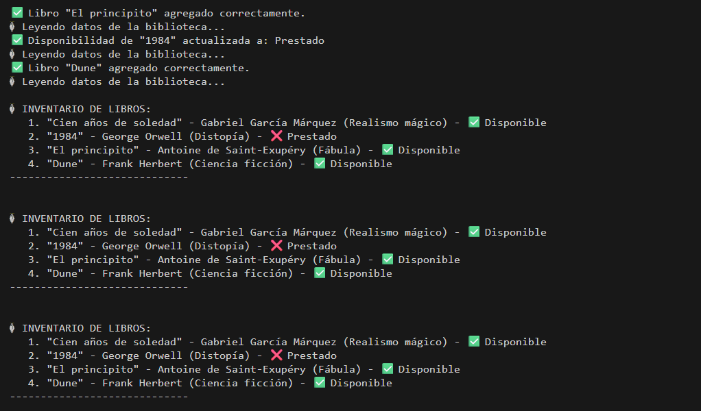

# 📚 Sistema de Gestión de Biblioteca

## Descripción del Proyecto

Este proyecto es un **sistema de gestión de biblioteca** desarrollado en JavaScript (Node.js) que demuestra el uso de **callbacks** y **operaciones asincrónicas** para simular la lectura y escritura de datos. 

El sistema permite agregar libros, actualizar su disponibilidad y mostrar el inventario completo de la biblioteca, utilizando operaciones asincrónicas simuladas mediante `setTimeout`.

## ¿Qué Sucede en el Código?

### 1. **Estructura de Datos Inicial**
```javascript
let biblioteca = {
    "libros": [
        { "titulo": "Cien años de soledad", "autor": "Gabriel García Márquez", "genero": "Realismo mágico", "disponible": true },
        { "titulo": "1984", "autor": "George Orwell", "genero": "Distopía", "disponible": true }
    ]
};
```
- La biblioteca comienza con 2 libros predefinidos
- Cada libro tiene: título, autor, género y estado de disponibilidad

### 2. **Funciones Asincrónicas Base**

#### `leerDatos(callback)`
- **Propósito**: Simula la lectura de datos de un archivo/base de datos
- **Tiempo**: Demora 1 segundo
- **Acción**: Ejecuta el callback pasando los datos de la biblioteca
- **Uso**: Leer el estado actual de los libros antes de hacer cambios

#### `escribirDatos(nuevosDatos, callback)`
- **Propósito**: Simula la escritura/guardado de datos
- **Tiempo**: Demora 1 segundo
- **Acción**: Actualiza el objeto `biblioteca` global y ejecuta el callback
- **Uso**: Guardar cambios después de agregar o modificar libros

### 3. **Funciones de Interacción**

#### `mostrarLibros()`
Muestra todos los libros en el inventario actual:
- Lee los datos con `leerDatos()`
- Itera sobre cada libro y muestra su información
- Indica si está disponible o prestado con emojis (✅/❌)
- Se ejecuta de forma asincrónica

#### `agregarLibro(titulo, autor, genero, disponible)`
Agrega un nuevo libro a la biblioteca:
1. Lee los datos actuales (para no perder nada)
2. Crea un objeto nuevo con el libro
3. Lo agrega al array de libros
4. Guarda los cambios
5. Muestra un mensaje de confirmación
6. Actualiza la vista del inventario

#### `actualizarDisponibilidad(titulo, nuevoEstado)`
Cambia el estado de disponibilidad de un libro:
1. Lee los datos actuales
2. Busca el libro por título (insensible a mayúsculas/minúsculas)
3. Actualiza su estado (disponible/prestado)
4. Guarda los cambios
5. Muestra un mensaje de confirmación

### 4. **Flujo de Ejecución**

Cuando ejecutas el archivo (`node biblioteca.js`), ocurre lo siguiente:

```
┌─────────────────────────────────────────────────────┐
│ 1. Mostrar inventario inicial (2 libros)            │
│    ↓ (Espera 1 segundo por leerDatos)              │
├─────────────────────────────────────────────────────┤
│ 2. Agregar "El principito"                         │
│    ↓ leerDatos (1s) → agregarLibro → escribirDatos (1s) │
│    ↓ mostrarLibros (1s)                            │
├─────────────────────────────────────────────────────┤
│ 3. Actualizar disponibilidad de "1984" a prestado  │
│    ↓ leerDatos (1s) → escribirDatos (1s)           │
│    ↓ mostrarLibros (1s)                            │
├─────────────────────────────────────────────────────┤
│ 4. Agregar "Dune"                                  │
│    ↓ (Similar al paso 2)                           │
├─────────────────────────────────────────────────────┤
│ 5. Intentar actualizar "El Hobbit" (no existe)     │
│    ↓ Muestra mensaje de error                      │
└─────────────────────────────────────────────────────┘
```

## Conceptos de Programación Demostrados

✅ **Callbacks**: Funciones pasadas como parámetros que se ejecutan cuando una operación asincrónica termina

✅ **Asincronía**: Las operaciones no bloquean la ejecución del programa

✅ **Event Loop**: Cómo JavaScript maneja múltiples operaciones pendientes

✅ **Operaciones I/O simuladas**: `setTimeout` simula operaciones de lectura/escritura de archivos

✅ **Manipulación de Arrays y Objetos**: `push()`, `find()`, métodos útiles de JavaScript

✅ **Control de Flujo**: Manejo de dependencias entre operaciones asincrónicas

## Cómo Ejecutar

### Opción 1: Desde la terminal
```bash
node biblioteca.js
```

### Opción 2: Desde VS Code
1. Abre el archivo `biblioteca.js`
2. Haz clic derecho y selecciona "Run Code" (si tienes la extensión Code Runner)
3. O usa la terminal integrada con el comando anterior

## Salida Esperada

```
🚀 INICIANDO SISTEMA DE GESTIÓN DE BIBLIOTECA
============================================

📚 INVENTARIO DE LIBROS:
   1. "Cien años de soledad" - Gabriel García Márquez (Realismo mágico) - ✅ Disponible
   2. "1984" - George Orwell (Distopía) - ✅ Disponible
-----------------------------

📖 Leyendo datos de la biblioteca...
💾 Guardando cambios en la biblioteca...
✅ Libro "El principito" agregado correctamente.
📖 Leyendo datos de la biblioteca...
📚 INVENTARIO DE LIBROS:
   1. "Cien años de soledad" - Gabriel García Márquez (Realismo mágico) - ✅ Disponible
   2. "1984" - George Orwell (Distopía) - ✅ Disponible
   3. "El principito" - Antoine de Saint-Exupéry (Fábula) - ✅ Disponible
-----------------------------

(... más operaciones ...)
```

## Puntos Clave

🔄 **Operaciones Encadenadas**: Cada operación depende de la anterior. Se usan callbacks para mantener el orden correcto.

⏱️ **Demoras Simuladas**: `setTimeout` simula el tiempo que tardaría una operación real de lectura/escritura en un servidor.

🔍 **Búsqueda Flexible**: La función `find()` busca libros sin importar mayúsculas/minúsculas.

📝 **Validación**: Se verifica si un libro existe antes de modificarlo.

## Posibles Mejoras

- Convertir callbacks a **Promises** o **async/await** para un código más limpio
- Agregar más funciones (eliminar libros, búsqueda avanzada)
- Guardar datos en un archivo JSON real
- Agregar interfaz web (HTML + CSS)
- Implementar base de datos

## Estructura del Proyecto

```
Biblioteca_libros/
├── biblioteca.js    # Sistema de gestión (este archivo)
└── README.md        # Documentación (este archivo)
```
## Imágenes Representativas

### Vista Principal de la Terminal






---

**Nota**: Este es un proyecto educativo diseñado para comprender callbacks y asincronía en JavaScript. En aplicaciones reales, se usarían Promises o async/await en lugar de callbacks anidados.

