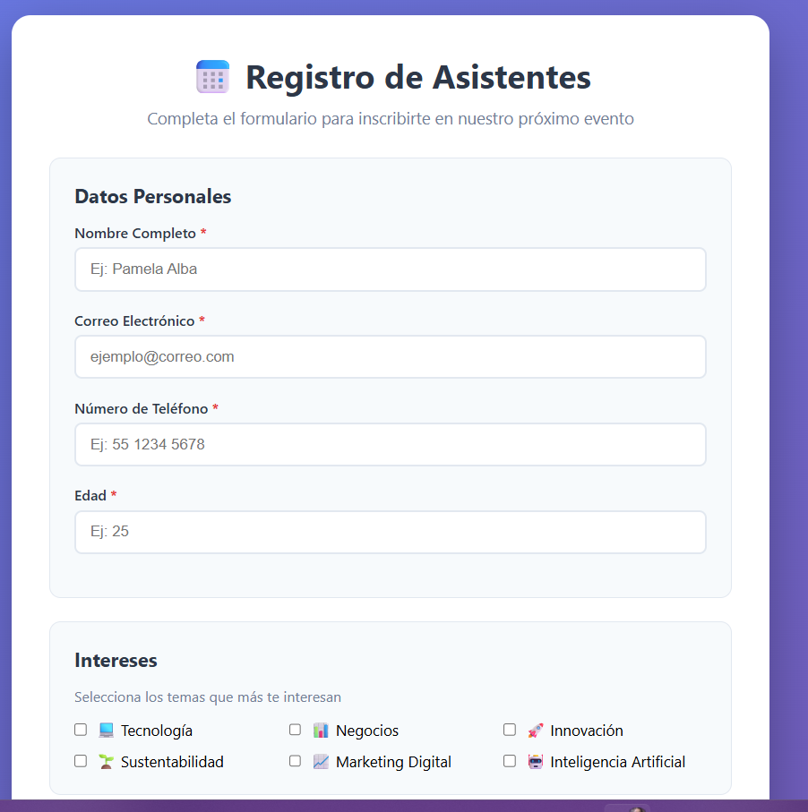
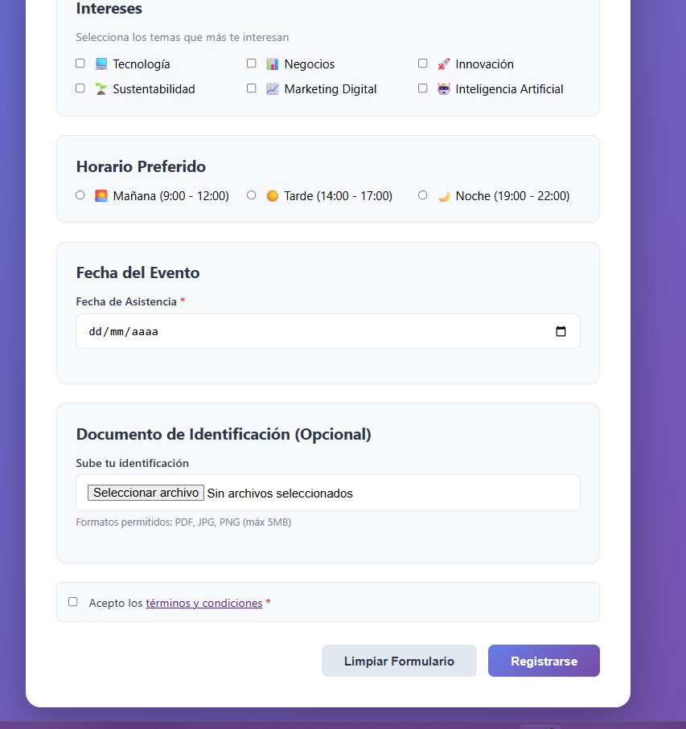

# Registro de Eventos

Este proyecto es un formulario de registro para asistentes a un evento. Permite capturar datos personales, intereses, horario preferido, fecha de asistencia y un documento opcional, con validaciones en tiempo real desde JavaScript.

## Qué hace

- Valida nombre, correo, teléfono, edad y fecha antes de permitir el envío.
- Obliga a seleccionar al menos un interés y un horario preferido.
- Verifica que los términos y condiciones estén aceptados.
- Revisa el archivo adjunto para aceptar solo PDF, JPG o PNG de hasta 5 MB.
- Muestra un modal de confirmación con los datos capturados cuando el formulario es correcto.
- Limpia el formulario y los mensajes de error al reiniciarlo o cerrar el modal.

## Archivos principales

- index.html: estructura del formulario y del modal de éxito.
- styles.css: estilos visuales del formulario, estados de error y modal.
- app.js: lógica de validación, manejo de eventos y visualización del resumen final.

## Cómo funciona

1. El usuario completa el formulario.
2. El script valida cada campo mientras escribe o cambia la información.
3. Si hay errores, se muestran mensajes específicos y se marca el campo correspondiente.
4. Si todo es válido, se abre un modal con el resumen del registro.
5. Al cerrar el modal, el formulario se reinicia para un nuevo registro.

## Imágenes Representativas

### Vista Principal de la Aplicación

## Nota

El proyecto funciona del lado del cliente, sin backend. Está pensado como práctica de manipulación del DOM, validación de formularios y manejo de eventos en JavaScript.