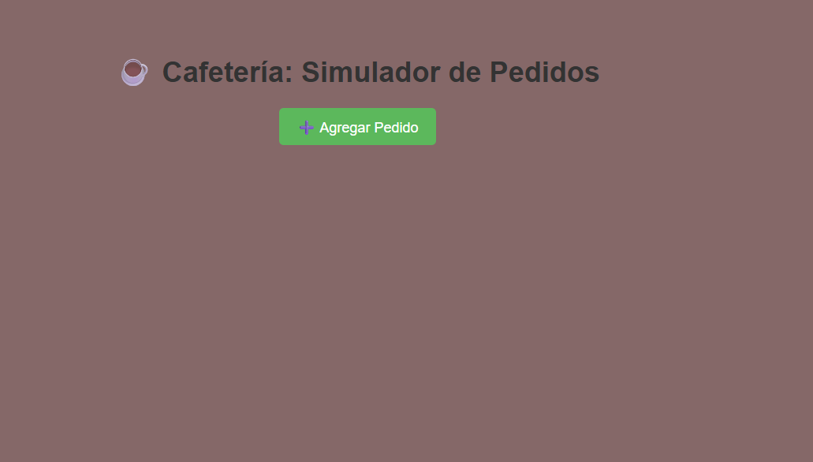
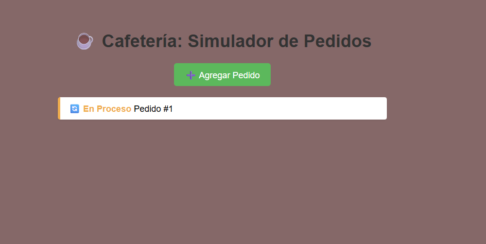
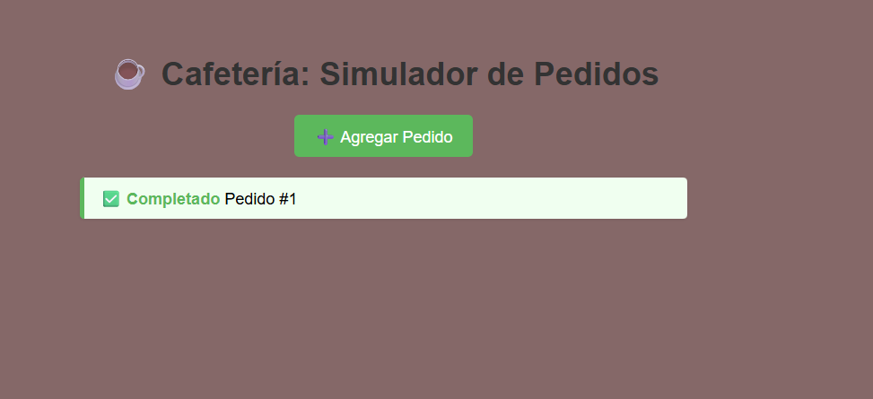
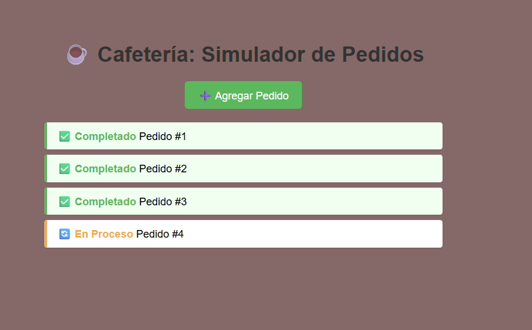

# ☕ Simulador de Pedidos en Cafetería

## Descripción del Proyecto

Este proyecto es un **simulador interactivo de pedidos en cafetería** desarrollado con HTML, CSS y JavaScript. Permite a los usuarios agregar pedidos que se procesan de manera asincrónica, simulando el tiempo de preparación real de una cafetería.

### Características principales:

- **Agregación de pedidos**: Botón para crear nuevos pedidos con IDs únicos e incrementales
- **Procesamiento asincrónico**: Utiliza Promises y async/await para simular la preparación de los pedidos
- **Tiempo aleatorio de preparación**: Cada pedido toma entre 1-3 segundos para completarse
- **Actualización de estado en tiempo real**: Muestra el progreso de cada pedido (En Proceso → Completado)
- **Interfaz intuitiva**: Diseño limpio con indicadores visuales de estado

## Tecnologías Utilizadas

- **HTML5**: Estructura del proyecto
- **CSS3**: Estilos responsivos y animaciones suaves
- **JavaScript (ES6+)**: 
  - Promises y async/await
  - DOM manipulation
  - Event listeners
  - Funciones asincrónicas

## Conceptos de Programación Demostrados

Este proyecto es una excelente práctica para comprender:
- ✅ Asincronía en JavaScript
- ✅ Promesas (Promises)
- ✅ Funciones async/await
- ✅ Event Loop y concurrencia
- ✅ Manipulación del DOM
- ✅ Gestión de estados en la UI

## Cómo Usar

1. Abre el archivo `index.html` en tu navegador
2. Haz clic en el botón "➕ Agregar Pedido" para crear nuevos pedidos
3. Observa cómo los pedidos cambian de estado "En Proceso" a "Completado" después de 1-3 segundos
4. Puedes agregar múltiples pedidos simultáneamente

## Estructura del Proyecto

```
Pedidos_cafeteria/
└── Pedidos_cafe/
    ├── index.html      # Estructura HTML
    ├── style.css       # Estilos CSS
    ├── cafeteria.js    # Lógica JavaScript
    └── README.md       # Este archivo
```

## Imágenes Representativas

### Vista Principal de la Aplicación


### Pedidos en Proceso


### Pedidos Completados


### Demostración de Múltiples Pedidos


---


