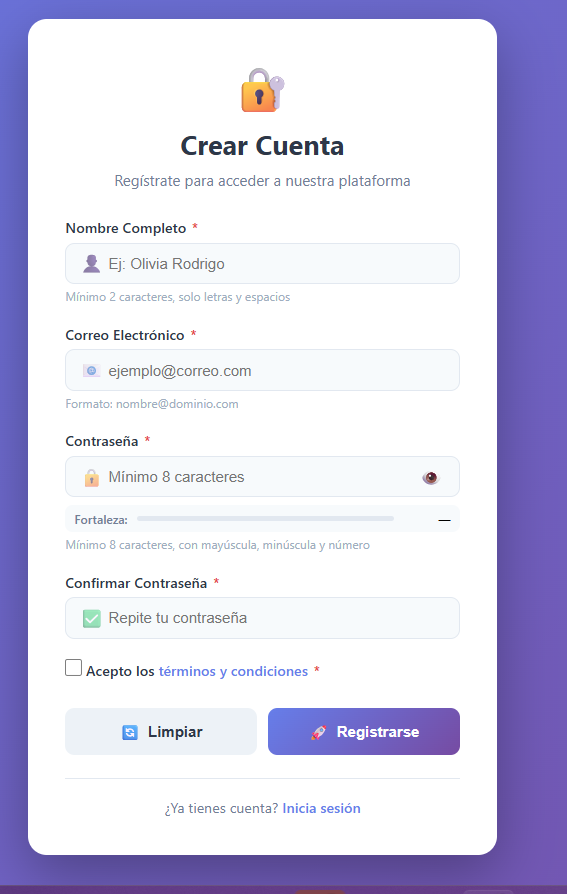
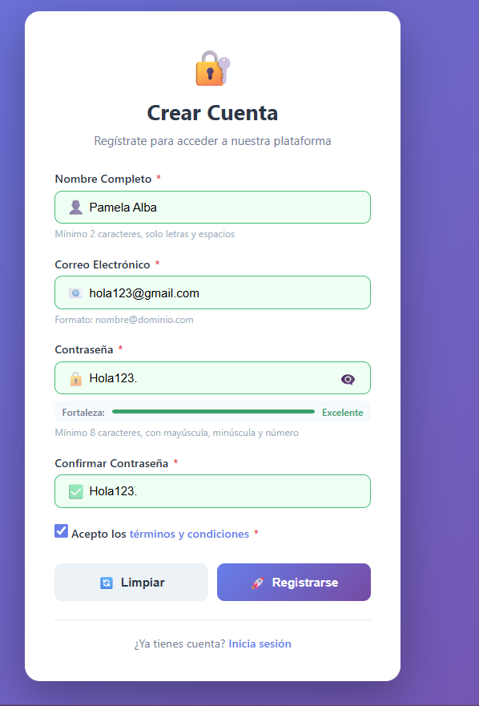
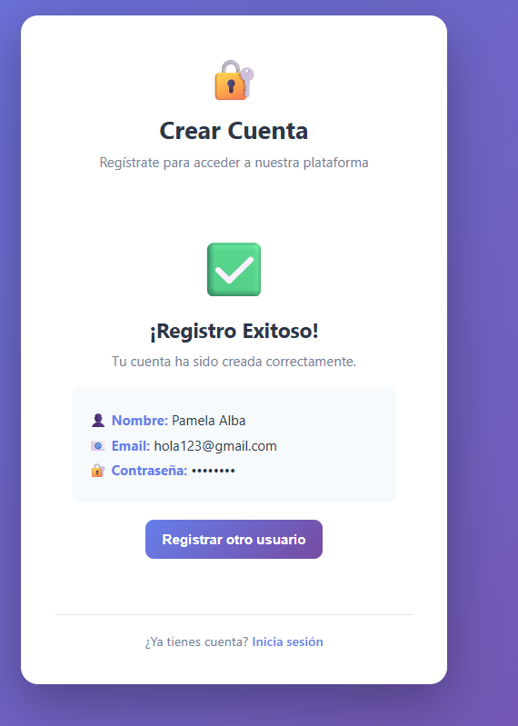

# Registro con Validación Zod

Este proyecto es un formulario de registro hecho con HTML, CSS y JavaScript. Usa la librería Zod para validar los datos del usuario en tiempo real y mostrar mensajes claros de error o éxito.

## Qué hace

- Valida nombre, correo, contraseña, confirmación de contraseña y aceptación de términos.
- Revisa que la contraseña tenga longitud mínima, mayúsculas, minúsculas, números y caracteres especiales.
- Muestra la fortaleza de la contraseña mientras el usuario escribe.
- Permite mostrar u ocultar la contraseña desde un botón.
- Simula el envío del formulario y muestra un mensaje de registro exitoso con los datos capturados.

## Archivos principales

- [index.html](index.html): estructura del formulario y del mensaje de éxito.
- [styles.css](styles.css): estilos visuales, estados de error, fortaleza de contraseña y diseño responsive.
- [app.js](app.js): lógica de validación con Zod, manejo de eventos y comportamiento del formulario.

## Cómo funciona

1. El usuario completa el formulario.
2. JavaScript valida cada campo mientras escribe o cambia valores.
3. Si un dato es inválido, se muestra un error específico debajo del campo.
4. Si todo es correcto, el formulario se oculta y aparece el mensaje de éxito.
5. Al limpiar el formulario, se restablecen los estados visuales y los mensajes.

## Imágenes Representativas

### Vista Principal de la Aplicación

## Nota

Este proyecto funciona solo del lado del cliente. Es una práctica de validación de formularios, manejo del DOM y uso de Zod para reglas de validación más legibles.